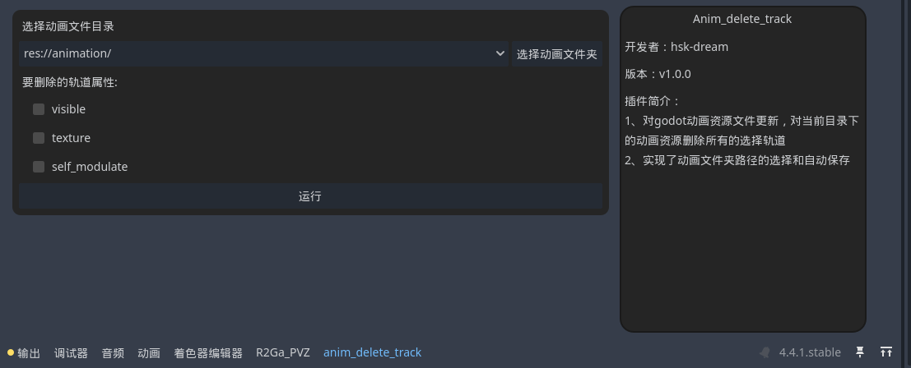

# anim_delet_track
Godot插件，一键删除目录下所有动画资源文件的被选择轨道

## 使用

1. 下载本项目后解压，将 `addons` 目录下的 `anim_delete_track` 文件夹复制到你的 Godot 项目中的 `addons` 文件夹下  
   > ⚠️ 如果项目中没有 `addons` 文件夹，请手动创建一个。

2. 在 Godot 的 **项目设置 → 插件** 中启用 `anim_delete_track` 插件。

3. 启用插件后，在底部面板中点击 `anim_delete_track` 标签，打开插件界面。

4. 插件界面中选择**原始动画文件目录**
4. 插件界面中选择**轨道属性**
5. 点击【运行】按钮后，插件将自动删除目录下所有动画资源的轨道。